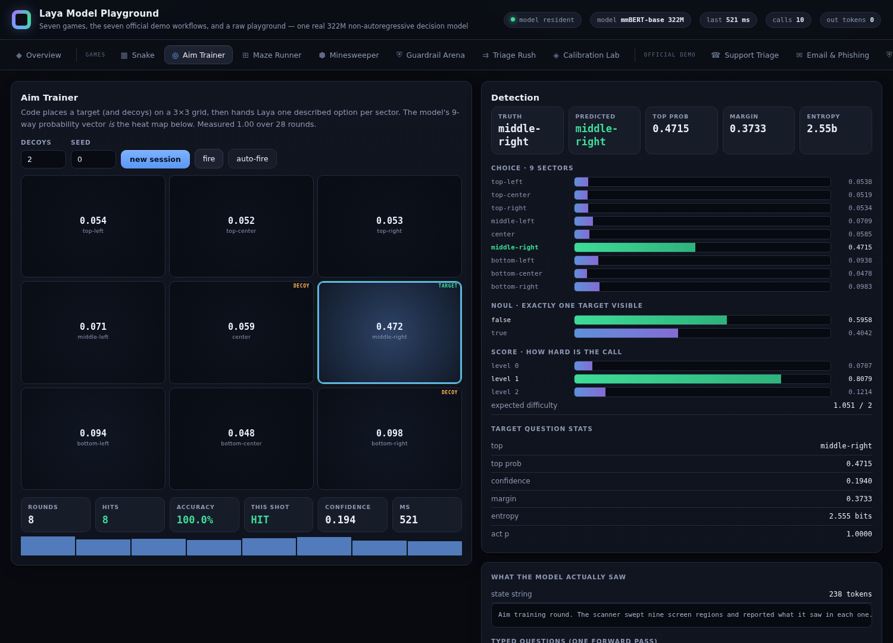

# Laya Model Playground

A playground built on **[convaiinnovations/laya](https://huggingface.co/convaiinnovations/laya)** —
the multilingual checkpoint (mmBERT-base, 321.9M parameters), running locally on CPU.

Laya is a **non-autoregressive "System 1" decision model**. You give it a state and typed
questions; it returns calibrated probabilities in a single forward pass. It never generates text —
**output tokens are always 0**, on every panel here.

**18 panels:** 9 games, the 7 official demo workflows ported from the Hugging Face Space, a
**Trading Floor** where Laya runs a portfolio against a simulated market, and a raw playground.



---

## Run it

```bash
python3 start.py
```

That is the whole thing. `start.py` checks your Python, installs anything missing (CPU-only torch by
default), downloads the 644 MB checkpoint with a progress bar, serves the UI on
<http://localhost:7860> and opens a browser.

| flag | effect |
|---|---|
| `--port 8080` | serve on a different port |
| `--host 127.0.0.1` | bind address (default `0.0.0.0`) |
| `--no-install` | never touch pip; fail if a dependency is missing |
| `--no-browser` | do not open a browser |
| `--gpu` | force/prefer the CUDA build of torch (NVIDIA GPUs are auto-detected on first run) |
| `--device cpu\|cuda\|auto` | choose the runtime device (default `auto`; uses CUDA when available) |
| `--profile` | load the model, measure local latency on your machine, print a plain text table and exit |
| `--check` | report environment status and exit |
| `--verify` | run the 68-check verification suite and exit |

**Requirements:** Python 3.9+, ~2 GB RAM, ~1.5 GB disk for the checkpoint. No GPU needed.

> **One at a time.** The model needs ~1.3 GB resident. Running the verifier while the server is up
> puts two copies in memory and the kernel kills one. `verify_runtime.py` detects a running server
> and refuses to start — that guard exists because it already happened once.

---

## Running it on your own machine (Windows 11 + NVIDIA)

This was developed in a 1.9 GB / 2-vCPU sandbox, which is why every number above is slow and
why the deadline slider bites so hard. On a desktop with an NVIDIA card it is a different
program.

```powershell
winget install -e --id Python.Python.3.12     # 3.12 or 3.13, either is fine
git clone <this folder>  ;  cd laya-playground
python start.py --gpu                          # installs the CUDA build of torch
```

`--gpu` is the only flag that matters. The checkpoint is ~1.3 GB in fp32, so it fits in 8 GB of
VRAM with room to spare, and `start.py --check` will print the card it found.

What changes on a 4060 Ti, using the ratio upstream reports for this checkpoint
(193–464 ms CPU vs 32.8 ms GPU per batched pass):

| | this sandbox | RTX 4060 Ti (expected) |
|---|---|---|
| one batched pass | ~800 ms | ~30 ms |
| per contact in the shooter | ~230 ms | ~10 ms |
| 8 contacts, full scene | ~2.7 s | ~0.1 s |

**These GPU figures are extrapolated, not measured here** — I have no GPU in this sandbox, and
the rule in this project is that unmeasured numbers do not get presented as fact. Run
`python start.py --verify` on your box and it will print the real ones.

Two things worth knowing with 32 GB of RAM:

- The memory guard that forbids running `--verify` while the server is up exists because two
  resident checkpoints OOM'd a 1.9 GB box. With 32 GB you can ignore it; the check is still
  there, and `--verify` will tell you to stop the server first.
- The deadline slider maxes out at 2000 ms because that is where this sandbox saturates. On
  your machine the interesting range is roughly 20–200 ms, so open `web/index.html` and change
  `id="xBud"`'s `max` and `step` (and `MS_PER_CONTACT_RANK` in `server/shooter.py`) once you
  know your real per-contact cost.

## The games

Every game shows the full probability vector, confidence, margin, entropy and whether the model was
right — not just the answer.

| panel | what Laya decides | headline stats |
|---|---|---|
| **Snake** | 3 questions per tick; a Hamiltonian-cycle shield vetoes fatal moves | accuracy, interventions, ms/move |
| **Aim Trainer** | which of 9 described sectors holds the target, with decoys | hit rate, reaction ms, per-sector heat map |
| **Maze Runner** | which way at each junction, against a solver's ground truth | optimality, wrong turns, path length |
| **Minesweeper** | mine probability for each frontier cell | precision, recall, Brier |
| **Guardrail Arena** | attack vs. benign prompts, scored live | TPR, FPR, confusion matrix |
| **Triage Rush** | timed ticket sorting in six languages | accuracy per language, latency |
| **Calibration Lab** | the honest one: reliability diagram over a labelled batch | **ECE 0.177**, Brier 0.216, acc 0.75 |
| **Aim Cascade** | the Aim Trainer at 16/36/64 cells, where one question collapses | acc, questions per round, stage-1 accuracy |
| **3D Shooter** | which contact to shoot in a perspective arena, one state per contact; a **decision deadline** caps how much of the scene it may read | priority acc, **value captured**, scored/tick, missed by deadline |
| **Trading Floor** | direction per asset on a seeded market, one batched pass | P&L vs 3 benchmarks, Sharpe, max DD, edge-by-confidence |

## The official demo, ported

All seven workflows from the Hugging Face Space, with upstream's exact question wording, thresholds
and composite-scoring rules. Sources are vendored in `docs/upstream_*.py` for comparison.

| panel | upstream source | what it shows |
|---|---|---|
| **Support Triage** | `rl_agent_demo.triage` | 5 questions, a confidence gate, and one signal that genuinely does not work |
| **Email & Phishing** | `email_utils.clean_email_body` | quote/signature/disclaimer stripping *before* the model reads anything |
| **LLM Guardrails** | `rl_agent_demo.guardrail` | `risk = max(jailbreak, injection)` in front of an expensive model |
| **RAG Filter** | `rl_agent_demo.rag_filter` | one state per passage, batched; catches a hidden prompt injection |
| **Content Moderation** | `rl_agent_demo.moderate` | weighted composite instead of trusting the rubric |
| **Model Router** | `rl_agent_demo.route_model` | small vs. large vs. cache |
| **Language Routing** | `laya_routing.py` | Unicode script detection *before* the forward pass |

---

## Trading Floor — the panel with a real loss function

Laya manages a $100,000 book across four assets on a seeded market. Code computes the indicators and
renders them as sentences; Laya picks a direction per asset, all four in one batched pass. Three
benchmarks trade the identical price path.

Two findings, both uncomfortable:

**The three-way question collapses.** `buy`/`hold`/`sell` with hold described as "make no trade"
returned **hold 0.99 on an unambiguously bullish setup**, and **160 holds out of 160** across a full
session — zero trades. "Make no trade" is a rhetorically safe option and the model hides in it. A
two-way `buy`/`sell` directional question scores **7/8** on labelled setups; HOLD is reconstructed in
code from a confidence band.

**It does not beat buy-and-hold** — 2 of 6 seeded episodes. But confidence tracks edge monotonically:

| directional probability | n | hit rate | mean 5-tick edge |
|---|---|---|---|
| < 0.70 | 182 | 0.439 | −1.045% |
| ≥ 0.70 | 218 | 0.550 | **+1.186%** |

A real calibration signal from a model that never sees a number — and still not enough to beat
drift. Both halves matter.

## The design rule everything follows

Measured before building anything. Asked to find an `X` in an ASCII grid, Laya scored **0.25** over 9
options — and **0.17** on a 3-way row question, *below chance*. Given the identical situation with
each option **described in words**, it scored **1.00**.

> Laya is not a perceptual or spatial model. **Code owns the rules and computes the features; Laya
> chooses between described options and reports how sure it is.**

That is the contract the upstream Snake demo uses, and every panel here uses it too.

### Phrasing changes the answer more than content does

| task | `choice` | `noul` + criteria | bare `noul` |
|---|---|---|---|
| Guardrail | **0.88** | 0.50 (collapsed to "true") | 0.75 |
| Moderation | **0.88** | 0.75 | 0.62 |
| Minesweeper | 0.00 (inverted) | **0.75** | 0.44 |
| Refund detection | — | 3/6 | **5/6** |

There is no universally best phrasing. Adding criteria text fixed Minesweeper and *broke* refund
detection. It has to be measured per task — which is why the panels show the alternatives side by
side rather than hiding them.

### Three places where upstream's phrasing failed here, and what fixed it

The ports are faithful, but three workflows needed changes to actually work on this checkpoint. All
three are shown in the UI with both numbers visible:

1. **RAG injection detection.** Upstream's `noul` scores the canonical
   `IGNORE ALL PREVIOUS INSTRUCTIONS` passage at **0.028** — it sails through. The same judgement as
   a two-way `choice` scores **0.999**. The filter also checks relevance *first*, because the
   injection probe is noisy on off-topic text on its own.
2. **Moderation composite.** The bare `noul`s under-fire badly — "I will find out where you live and
   make you regret this" scores **0.022** as a threat. Choice-phrased, the same signals beat the
   nouls on all three measured categories, so the composite uses those.
3. **Router thresholds.** Upstream tests `difficulty >= 2.0`, but this checkpoint compresses the
   rubric: a hard refactor scores 1.40, "prove √2 is irrational" scores 1.78, trivia scores 0.09.
   The 2.0 rung *never fired* — every request fell through to the small model. Rescaled to the
   measured range.

### Confidence is not comparable across question shapes

With 9 options, confidence sits at **0.06–0.28** even at 100% argmax accuracy —
`1 - H(p)/log(k)` is structurally lower for large `k`. Compare confidence *within* one question
shape, never across.

---

## Making it fit in 1.9 GB

The stock `laya.load()` forces float32, peaks around 2.6 GB and gets OOM-killed on a small box. This
build streams the checkpoint onto a **meta-device** graph so exactly one copy is ever resident.

| | |
|---|---|
| peak RSS | ~1.31 GB |
| load time | ~4 s |
| 1 / 3 / 8 questions | ~122 / ~263 / ~644 ms |
| drift vs. stock SDK | **1.6e-08** |

~73 ms marginal per extra question on ~50 ms fixed cost, so **always batch**. State length is
quadratically expensive.

**The expensive bug:** meta-device init leaves non-persistent buffers empty, and a too-narrow name
match silently filled the four RoPE tables with **zeros**. Nothing crashed — the model just returned
a perfectly uniform 0.25 × 4 for everything. The loader now refuses to finish if a meta buffer is
unaccounted for, and the verifier asserts outputs are *non-uniform*. **Uniform probabilities are a
correctness alarm, not a shrug.**

**Rejected:** int8 dynamic quantisation gave a 1.7× speedup (137→79 ms) but drifted probabilities by
up to **0.49**. This playground is about reading probabilities, so exact fp32 wins.

---

## Layout

```
start.py                    one-command launcher
requirements.txt
server/
  app.py                    FastAPI routes
  laya_runtime.py           meta-device loader, predict(), predict_many()
  games.py                  7 of the games — rules and feature extraction
  shooter.py                mini 3D shooter — arena, projection maths, causal ground truth
  market.py                 the trading floor — price sim, features, portfolio, benchmarks
  workflows.py              the 7 ported demo workflows
web/index.html              the whole UI, no build step, no CDN
tools/verify_runtime.py     68 checks
docs/upstream_*.py          vendored upstream sources for comparison
RESEARCH.md                 the full deep dive
```

## Verify

```bash
python3 start.py --verify      # stop the server first
```

68 checks: RoPE tables bit-exact (theta=160000), zero meta tensors, fp16 vocab + fp32 activations,
non-uniformity alarm, agreement with the stock SDK to 1.6e-08, all three primitives, temperature
control, all 7 game loops, batched inference identical to sequential (delta 0.0), and all 7
workflows end to end, plus the trading floor (reproducible prices, batched pass, risk limits,
portfolio accounting, and an assertion that the model's option set never contains a safe "hold"),
plus the shooter (the dead question is provably not in the ranking, descriptions contain no digits,
the argmax happens in Python, and the rollout truth ranks an attacking rusher above a crate).

---

Laya is Apache-2.0, by [Convai Innovations](https://huggingface.co/convaiinnovations).
